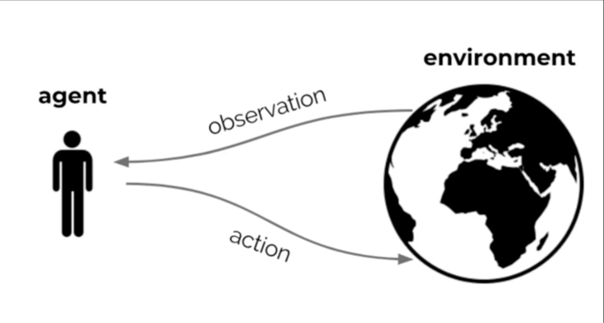

# RL

## What is artificial intelligence

> To be able to **learn** to make **decisions** to achieve **goals**

## What is reinforcement learning?

- Learn by interacting with our enviroment
- Is **active**
- Interactions are often **sequential**
- **goal-directed**
- Learn **without examples**
- Optimise some **reward signal**

 

> Go inside the agent to figure out how we can build learning algorithms that can help that agent learn to interact better, that is, the agent is going to try to optimize some reward signal and this spicifies a goal, the goal is too optimise sum of rewards into the future.

Reward given by the environment or internal to the agent? Both, it's easier to think about it in one way or another depending on the context.

###### Reward hypothesis

> Any goal can be formalized as the outcome of maximizing a cumulative reward

###### Examples of RL

###### So... what is reinforcement learning?

> **Reinforcement learning is the science and framework of learning to make decisions from interaction**

###### Factors:

- Time 
- Long-term consequences of action
- Actively gathering experience
- Predicting the future
- Dealing with uncertainty

## Agent and environment

###### Notation

 At each step $t$:

- The agent receives observation $O_t$ and reward $R_t$ and executes action $A_t$.
- The environment receives observation $A_t$ and emits observation $O_{t+1}$ and reward $R_{t+1}$

Where $R_t \in \mathbb{R}$

###### Definition

Culmulative reward ($G_t$) is given by:
$$
G_t = R_{t+1} + R_{t+2} + ...
$$

###### Note:

>  Only depends on the future since we cant change the past

###### Definition

The expected cumulative reward from a state $s$, also called the value is given by:
$$
v(s) = \mathbb{E}[G_t | S_t = s]
$$

###### Note

> Since the value depends on the actions the agent takes the goal is to maximize the valua by picking suitabhle actions.

###### Observation

It's usefull to rethink return and values recursively:
$$
\begin{align}
G_t &= R_{t+1} + G_{t+1} \\
v(s) &= \mathbb{E}[R_{t+1} + v(S_{t+1})| S_t = s]
\end{align}
$$

###### Note

> The goal is to select actions to maximise value, actions may have long-term consequence so the reward may be delayed and it may be better to sacrifice inmediate reward to gain more long-term reward

###### Definition

A **policy** is a mapping from states to actions.

## Agent components

The agent components are:

- State
- Policy
- Value function
- Model

#### State

> The state contains that which is kept along

###### Definition

The **history** is the full sequence os observations actions, rewards:
$$
H_t = O_0, A_0,R_1,...
$$

###### Definition

We say that the agent have **full observability** when the agent sees the full environment state:

- observation = environment state
- $S_t = O_t = environment state$

##### Markov decision process

###### Definition

A decision process is markov if
$$
p(r,s | S_t, A_t) = p(r,s | H_t, A_t)
$$

###### Note

> A process is markovian if a probability of a reward and it's subsequent state doensn't change if we add more history. That means that the state contains all we need to know from the history.

> The agent State $S_t$ is some compression of the history $H_t$

###### Observation

If the environment is *partially observable* the observations are not markovian. This is called a **partially observable Markov decision process**

###### Definition

The *agent state* is a function of the history, generally:
$$
S_{t+1} = u(S_t, A_t, R_{t+1}, O_{t+1})
$$
Where $u$ is called the _state update function_.

###### Note

In some way we want $u$ to be a compression function.

#### Policy

> A policy $(\pi)$ is a map from agent state to action and defines the agent's behavior. It can be deterministic or stochastic

#### Value function

###### Definition

The _value function_ is the expected return given by:
$$
\begin{align}
v(s) &= \mathbb{E}[G_t| S_t = s, \pi] \\
v(s) &= \mathbb{E}[R_{t+1} + \gamma R_{t+2} + \gamma^2 R_{t+3}| S_t = s, \pi]
\end{align}
$$
Where $\gamma \in [0,1]$ is the _discount factor_. 

###### Note

> Discount factors lets us trade importance of inmediate vs long-term rewards.

###### Observation

It's usefull to rethink the values recursively:
$$
\begin{align}
v(s) &= \mathbb{E}[R_{t+1} + \gamma v_{\pi}(S_{t+1})| S_t = s, A_t \sim \pi(s)]
\end{align}
$$
where $A_t \sim \pi(s)$ means $A$ is sampled from the policy

###### Definition

The Bellman equation (1957) is given by
$$
\begin{align}
v^*(s) &= \max_a{ \mathbb{E}[R_{t+1} + \gamma v^*_{\pi}(S_{t+1})| S_t = s, A_t = a] }
\end{align}
$$
Where $v^*(s)$ Is the optimal value

###### Note

> The optimal value of state s is equal to the maximization over actions of the expected reward plus the discounted next optimal value conditioned on that state and action.

###### Observations

- This does not depend on a policy, only in the state. 
- This equality is heavily exploited to build algorithms and aproximate value functions.
- An accurate value function implies that we can behave optimally but also with suitable approximations we can behave very well.

#### Model

> A model of the world that predicts what the environment will do next

###### Example

A model predicts the next state:
$$
P(s, a, s') \approx p(S_{t+1} = s' | S_t = s, A_t = a)
$$

###### Example

A model predicts the next reward:
$$
R(s, a) \approx E(R_{t+1}| S_t = s, A_t = a)
$$

###### Note

We could also consider stochastic and generative models.

## Agent categories

###### Value based

The agent has a value function but not a policy (it's implicit). The policy is based on the value function.

###### Policy based

Has an explicit notion of a policy but not of a value function.

###### Actor critic

The agent has an explicit representation of the policy and of the value function. The value function is used to update the policy in some way.

###### Model free

Does not have a model of the environment.

###### Model based

The agent has a model of the environment.

## Subproblems of the RL problem

>  Prediction and control

###### Prediction

Evaluate the future for a given policy

###### Control

Optimise the future (find the best policy)

> Learning and planning

###### Learning

The environment is initially unknown so the agent has to learn how to interact with the environment

###### Planning

A model of the environment is given or leant and the agent plans in this model for future actions. 

> Learning refers to absorving new experiences from the interaction with the environment and planning is something inside the agent a completely internal process. Planning can be defined as any computational process that helps you improve your policies, predictions, ect. without looking at new experience.

