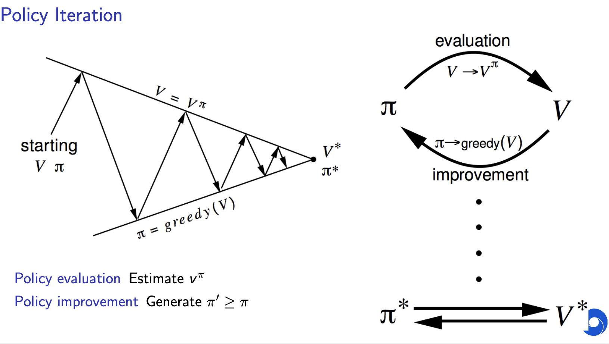

#### Introduction

| Framework           | Posible actions | State                | Model                              |
| ------------------- | --------------- | -------------------- | ---------------------------------- |
| Bandits             | Multiple        | One                  | No model                           |
| Dynamic programming | Multiple        | Sequential Structure | Given                              |
| Later               | Multiple        | Sequential Structure | Not given, obtained by interaction |

## Markov Decision Process

> Assumtion: The environment is fully observable

#### Note

Several problems can be formalised as an MDP:

- Optimal control problems deal with continuous MDPs
- Partially observable can be converted into MDP given the right history
- Bandits are MDP with one state

#### Definition:

A *Markov decision process* is a tuple $(S, A, p,  \gamma)$ where

	- $S$ ius the set of posible states
	- $A$ is the set of posible actions
	- $p = p(r,s' | s,a)$ 
	- $ \gamma$ is the discount factor

#### Observation:

- $p$ denotes the *transition dynamics* of the problem
- I'ts useful to marginalise out the state transitions as follow

$$
p(s' |s,a) =  \sum_r p(s',r | s,a) \\
E[R|s,a] =  \sum_r r  \sum_{s'} p(r,s' | s,a)
$$

#### Definition:

Consider a sequence of random variables $ \{ S_t\}_{t \in  \N}$. A state s has the *markov property* when
$$
p(S_{t+1} = s' | S_t = s) = p(S_{t+1} = s' | h_{t-1}, S_t = s)
$$
For all the history.

#### Observation

> The state S "sumarizes" all the history that it has seen before it in terms of the prediction value
>
> - The state captures all the relevant information from the history.
> - The state is a sufficient statistic of the past.

#### Definition:

Given a MDP the return at the timestep $t$ is given by:
$$
G_t = R_{t+1} +  \gamma R_{t+2} + ... +  \gamma^{T-t} R_T
$$
Where:

- $\gamma = 1$ Implies an undiscounted return
- $\gamma < 1$ Implies a discounted return
- $\frac{G_t}{T-t-1}$ is the average return

#### Observation:

The horizon can be infite ($T \to \infty$)
$$
G_t = \sum_{k=0}^\infty \gamma^k R_{t+k+1}
$$

#### Discussion:

Most MDP are discounted since:

- Sometimes it makes sense to have short term rewards
- Human and animals show preference for inmediate reward
- Matheematiocal conveniet
- Avoid infinite cycles

#### Definition

The *goal* of the agent is to find a behaviout poicy that maximises the expected return $G_t$

#### Definition

The *value function* is given by
$$
v_{\pi}(s) = \mathbb{E}[G_t | S_t =s, \pi]
$$
And the state-action values are given by
$$
q_{\pi}(s,a) = \mathbb{E}[G_t | S_t =s, A_t = a, \pi]
$$

#### Proposition

$$
\begin{align*}
v_\pi(s) &= \sum_a \pi(a|s)q_\pi(s,a) \\ 
&= E[q_\pi(S_t, A_t)| S_t =s, \pi]
\end{align*}
$$

#### Definition

The *optimal state-value function* is the maximum value function over all policies
$$
v^*(s) = \max_{\pi} v_\pi(s)
$$
The *optimal action-value function* is the maximum action-value function over all policies
$$
q^*(s,a) = \max_{\pi} q_\pi(s,a)
$$

#### Proposition

There exists a partial ordering in the policy space given by:
$$
\pi \geq \pi' \iff v_{\pi} \geq v_{\pi'}, \forall s
$$

#### Proposition (Optimal Policy)

$$
\pi^*(s,a) = \begin{cases} 1 \ \ a = argmax_{a \in A} q^*(s,a) \\ 0 \ \ otherwise \end{cases}
$$

#### Observation

> There is always a deterministic optimal policy for a given MDP

## Bellman equations

#### Theorem (Bellman Expectation Equations)

The value function can be written recursively
$$
\begin{align}
v_{\pi}(s) &= \mathbb{E}[G_t | S_t =s, \pi] \\
&= E[R_{t+1} + \gamma G_{t+1} | S_t = s, A_t \sim \pi(S_t)] \\
&= \sum_a \pi(a|s) \sum_r \sum_{s'} p(r,s'|s,a)(r + \gamma v_\pi (s'))
\end{align}
$$

Similarly for the state-action values function can be written recursively
$$
\begin{align}
q_{\pi}(s,a) =\sum_r \sum_{s'} p(r,s'|s,a)\left(r + \gamma \sum_{a'}\pi(a'|s') q_\pi(s',a')\right)
\end{align}
$$

## Problems in RL

#### Prediction - Policy evaluation

Estimating the value and state-action value function.

> Given a policy what is my expected return under that behaviour

#### Control - Policy optimisation

Estimating the optimal valua and state-action value function.

> What is the optimal way of behaving

#### Solving the bellman optimality Equation:

- Using Models (dynamic promgramming)
- Using sampling
  - Monte carlo
  - Q-learning
  - Sarsa

## Dynamic Programming

> A collection of algorithms that can be used to compute optimal policies given a perfect model of the environmet as an MDP

#### Note 

All this methods consist in two important parts

- Policy evaluation
- Policy optimization

#### Algorithm (Policy evaluation)

1. Initialize $v_0$
2. Iterate and update

$$
v_{k+1} = E[R_{t+1} + \gamma v_k(S_{t+1}) | s,\pi] \quad \forall s
$$

3. Stop whenever 
   $$
   v_{k+1}(s) = v_k(s)
   $$

#### Algorithm (Policy iteration)

1. Iterate using the policy

$$
\pi_{new} = argmax_a q_\pi(s,a)
$$

2. Evaluate and repeat

#### Algorithm (value iteration)

1. Initialize $v_0$
2. Iterate and update

$$
v_{k+1}(s) = \max_a \left[ E[R_{t+1} + \gamma v_k(S_{t+1}) | s,\pi] \right] \quad \forall s 
$$

3. Stop whenever 
   $$
   v_{k+1}(s) = v_k(s)
   $$

#### 

#### Dynamic programming algorithms summary

| Problem    | Bellman Equation                                           | Algorithm                   |
| ---------- | ---------------------------------------------------------- | --------------------------- |
| Prediction | Bellman Expectation Equation                               | Iterative Policy Evaluation |
| Control    | Bellman Expectation Equation + (Greedy) Policy Improvement | Policy Iteration            |
| Control    | Bellman Optimality Equation                                | Value Iteration             |

#### Observation

- Algorithms are based on the state-value function and have a complexity of $O(|A||S|^2)$ per iteration
- Could also apply to action-value function and have a complexity of $O(|A|^2|S|^2)$ per iteration

#### Prioritised Swepping

> Used to converge faster

- Use magnitud of bbellman error to guide state selection
- Update bellman error of affected states aftear each backup

